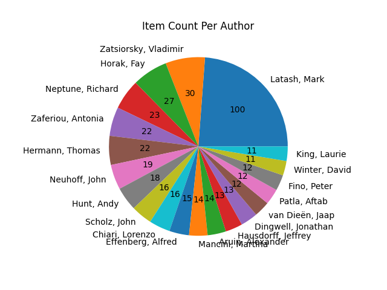
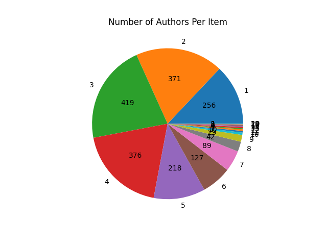

# zotero_library_utils

This project aims to provide tools to understand the makeup of a Zotero library, entirely locally, by interacting with Zotero's SQLite database. This package focuses on providing tools that Zotero itself does not provide.

# Installation
```bash
pip install zotero_library_utils
```

# Tools
## Counts
Provides counts of several pieces of metadata:
    
1. Number of articles from each author. Optionally, you can specify the number of slices shown.
```bash
python -m zotero_library_utils show-items-per-creator --num-slices=20
```


2. Number of different authors in the database (identified by first and last name)
```bash
python -m zotero_library_utils count-distinct-authors
```

3. Number of articles with 1-N authors. Optionally, you can specify the number of slices shown.
```bash
python -m zotero_library_utils show-creators-per-item --num-slices=20
```


## Timelines
Visualize timelines for various metadata:

1. Date added to the library

2. Date published

## Reference Graphs
Attempts to create a graph of the references using AI locally to read the PDF's. The result is similar to many existing cloud-based, closed-source tools, however this tool is entirely open-source, local, and reads your entire Zotero library to allow you to spot trends and gaps in your collection.